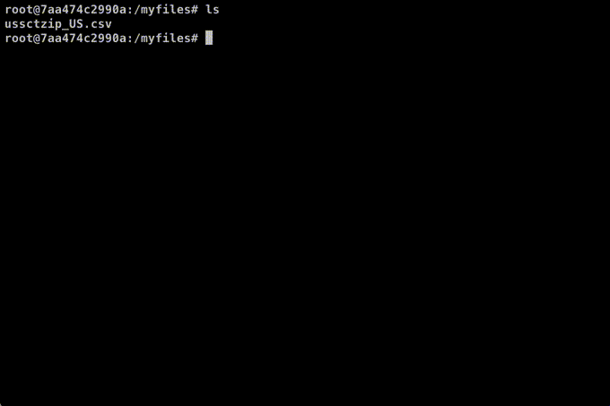

# The `pipeline` shell command

A utility to make building up a pipeline of shell commands easier, especially when
doing data exploration.

If you've ever found yourself writing shell code, in an endless loop of piping
output to `less`, scanning it over and making changes, then `pipeline` can make
your life just a little bit more beautiful.

This is just a thin wrapper around your shell, not some totally new data mining
tool. Launch pipeline, and start typing shell commands as usual. Every time you
hit enter you'll see a one-screen preview of your output, similar to piping
output to `less`, but your cursor will stay right where it was for further
editing.



**Ctrl-C** when you're done, to exit.

## Installation

Pipeline depends only on ncurses and readline (or libedit), both of which ship with MacOS and most common Linux distros.

### MacOS

Install with [Homebrew](https://brew.sh).

```sh
brew tap codekitchen/pipeline
brew install pipeline
```

### From Source

You can download the latest release tarball from the [releases page](https://github.com/codekitchen/pipeline/releases), or git clone the repo to build the master branch.

```sh
# only run this command if building from git, skip this if using the tarballs from release page
autoreconf -fi

./configure

make
```

After make finishes, you'll be able to use `./pipeline`. You can also install it using:

```sh
sudo make install
```

### Windows

It might work under MinGW/GitBash? Please let me know.

### Docker Container

The commands below will assist in the following;
  - Get a dockerfile, from this repository.
  - Build a lightweight docker image with the `powerline` shell command.
  - Add an alias that will enable you to call the powerline docker image as a container.
  - The Docker container will automatically mount the directory path you are at.
  - It will also spawn the `powerline` shell command, so you won't feel as if you are in a container.
 
 You will exit the docker container, when exiting the `powerline` shell command, the docker container will be removed after exiting the container.

```sh
# Get the dockerfile2 file
curl -L https://raw.githubusercontent.com/iAmG-r00t/pipeline/master/Dockerfile2 -o pipeline-dockerfile

# Build a powerline image
docker build -t pipeline:latest -f pipeline-dockerfile .

# Alias
alias pipeline='docker run -it --rm --name pipeline -v `pwd`:/root pipeline:latest' 
```

#### Note

**Docker** has to be installed.
